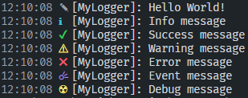

# @hammerhq/logger

😎 Cool looking logs for everyone!

```js
const { Logger } = require("@hammerhq/logger");

const logger = new Logger("[MyLogger]:");

logger.log("Hello World!");
logger.info("Info message");
logger.success("Success message");
logger.warning("Warning message");
logger.error("Error message");
logger.event("Event message");
logger.debug("Debug message");
```



# License

Copyright © 2022 [Barış DEMİRCİ](https://github.com/barbarbar338).

Distributed under the [GPL-3.0](https://www.gnu.org/licenses/gpl-3.0.html) License. See `LICENSE` for more information.

# Contributing

Feel free to use GitHub's features.

1. Fork the Project
2. Create your Feature Branch (`git checkout -b feature/my-feature`)
3. Run prettier (`npm run format`)
4. Commit your Changes (`git commit -m 'my awesome feature my-feature'`)
5. Push to the Branch (`git push origin feature/my-feature`)
6. Open a Pull Request

# Show your support

Give a ⭐️ if this project helped you!

# Contact

-   Mail: hammer@338.rocks
-   Discord: https://338.rocks/discord
-   Website: https://hammer.338.rocks
-   Documentation: https://hammer.338.rocks/packages/logger
